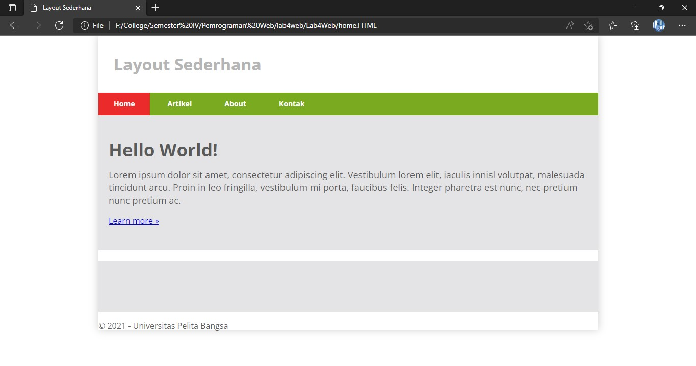

# Lab4Web
<b>Naufal Nirwansyah</b> 
<b>312010174</b> 
<b>TI. 20. A1</b> 
<b>Pemrograman Web</b> 
***
# Langkah - Langkah Praktikum 4

Buka aplikasi editor yang ada gunakan, disini saya menggunakan `Visual Code`  

  

## 1. Membuat Box Element
Tambahkan kode untuk membuat `Box Element` dengan tag `div` seperti berikut :

  

## 2. CSS Float Property

Selanjutnya tambahkan deklarasi CSS pada tag `head` untuk membuat float element, seperti dibawah ini, Kemudian running di  browser untuk melihat hasilnya.  

## 3. Mengatur Clearfix Element
`Clearfix` digunakan untuk mengatur element setelah float element. Property clear digunakan untuk mengaturnya. 
Tambahkan element div lainnya setelah `div3` dan kita tambahkan style CSS untuk `div4` yang baru dibawah `div3`  

`.div4 {`  
`background-color: blue;`  
`clear: left;` 
`float: none;`  
`}` 

Kemudian kita refresh browser kita, makan akan menampilkan output sebagai berikut :  
  

## 4. Membuat Layout Sederhana
Kemudian kita akan membuat layout web sederhana seperti gambar berikut. (tertera di modul Praktikum 4)

Buat folder baru dengan nama lab4_layout, kemudian buatlah file baru didalamnya dengan nama `home.html`, dan file css dengan nama `style.css`. 
Berikut adalah kode untuk `Home.HTML` 

 
  Jika kita running makan akan menampilkan output sebagai berikut:  

 
Kemudian kita tambahakan `Style.CSS`, dan jika kita running makan akan menambahkan output berupa style pada kode `Home.HTML` kita yang tadi. 

## 5. Membuat Navigasi
Kemudian kita lanjut membuat Navigasi, kita masukan kode berikut dan kita refresh browser kita maka akan terjadi perubahan sebagai berikut :  

## 6. Membuat Hero Panel
Selanjutnya kita membuat hero panel. Tambahkan kode HTML dan CSS seperti berikut :  
  
 
Jika kita refresh browser kita tadi maka akan menampilkan perubahan sebagai berikut :  

